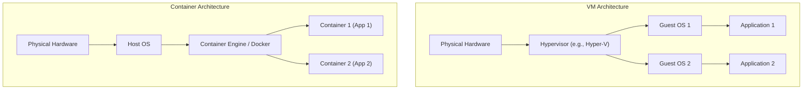

# Unit I: Basics of DevOps Infrastructure

## 📋 1. Core Concepts & Theory

### Origin of Containers
Before containers, applications were deployed directly on physical hardware or Virtual Machines (VMs). 
- **Physical Servers:** High cost, resource underutilization, hard to scale.
- **Virtual Machines:** Hypervisor sits above physical hardware to run separate Guest OS instances. This incurs high CPU/Memory overhead and slow startup times.
- **Containers:** Provide operating-system-level virtualization. Multiple isolated user-space instances run on a single host OS kernel, sharing the same operating system kernel while keeping individual files, environment variables, and processes separate.



### Emergence of Modern Containerization & DevOps Integration
Modern containerization was popularized by Docker in 2013 by packaging applications with all their dependencies into standardized units. 
In DevOps, this provides **parity between environments** (development, testing, production), resolving the classic problem of *"It works on my machine!"*

### Container Runtime, Namespaces & Cgroups
How does process isolation actually work in Linux? Containers rely on two key Linux kernel features:
1. **Namespaces:** Used for *Isolation*. It creates private views for processes.
   - **pid:** Isolates process IDs.
   - **net:** Isolates network interfaces.
   - **mnt:** Isolates filesystem mount points.
   - **ipc:** Isolates Inter-Process Communication resources.
   - **uts:** Isolates hostnames.
2. **Control Groups (cgroups):** Used for *Resource Allocation*. Limits and monitors hardware resource usage for a group of processes (e.g., CPU, Memory, Disk I/O).

---

## 🛠️ 2. Introduction to Docker & Architecture

Docker is a platform for developing, shipping, and running applications. It consists of:
- **Docker Daemon (`dockerd`):** A background service that manages Docker objects such as images, containers, networks, and volumes.
- **Docker CLI (`docker`):** The client used by developers to communicate with the daemon via the REST API.
- **Docker Registries:** Stores images (e.g., Docker Hub).

### Docker Object Types
- **Images:** Read-only templates used to create containers.
- **Containers:** Runnable instances of images.
- **Networks:** Provide isolated connectivity between containers.
- **Volumes:** Provide persistent storage.

---

## 💻 3. Practical Experiment: Installing & Running Docker

### Step 3.1: Installation
1. **Windows:** Download and run Docker Desktop. Enable the WSL 2 backend or use Hyper-V.
2. **Linux:** Install `docker.io` or follow the official Docker engine setup via APT or YUM.

### Step 3.2: Basic Commands
Open your terminal and try the following essential commands:

```bash
# Verify the Docker daemon is running and version is installed
docker version

# Pull an image from Docker Hub
docker pull nginx:latest

# List all local images
docker images

# Run a container from an image in detached mode
docker run -d -p 8080:80 --name amit_web_server nginx:latest

# List running containers
docker ps

# Print logs from a specific container
docker logs amit_web_server

# Stop the running container
docker stop amit_web_server

# Remove the container
docker rm amit_web_server
```

### Terminal Demonstration (Amit Example)

