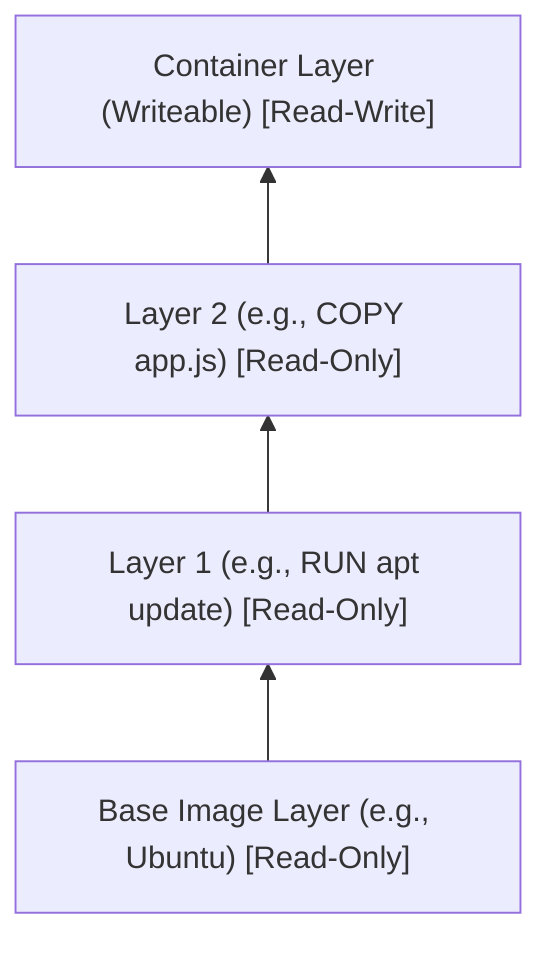

# Unit II: Image Building & Container Management

## 📋 1. Core Concepts & Dockerfile Instructions

### Image Layering & Copy-on-Write
Docker images are built up from a series of read-only layers. Each layer represents an instruction in the image’s Dockerfile.
When you start a container, a thin read-write layer (called the **container layer**) is added on top of the underlying read-only layers.
- **Copy-on-Write (CoW):** If a process inside the container needs to modify a file that exists in an underlying read-only layer, Docker copies the file to the top read-write layer before modifying it.



### Build Context & `.dockerignore`
The **build context** is the set of files that the Docker client sends to the Docker daemon when building an image.
To keep builds fast and prevent unnecessary files (like `.git`, `node_modules`, or local logs) from entering the daemon, use a `.dockerignore` file.

---

## 🛠️ 2. Step-by-Step Practical: Building & Managing Images

In this practical, we create a Node.js web application and containerize it using a high-quality Dockerfile.

### 📝 Step 2.1: The Application Files
Create the following `.dockerignore` file:

```text
node_modules
npm-debug.log
.git
```

Create the following `Dockerfile`:

```dockerfile
# Use a secure base image
FROM node:20-alpine

# Define metadata labels
LABEL maintainer="amit@example.com"
LABEL version="1.0.0"

# Set environment variables
ENV NODE_ENV=production
ENV PORT=3000

# Establish working directory
WORKDIR /usr/src/app

# Leverage caching for dependency installations
COPY package*.json ./
RUN npm ci --only=production

# Copy application source code
COPY . .

# Expose container port
EXPOSE 3000

# Configure execution command
CMD ["node", "server.js"]
```

---

## 🌐 3. Docker Networking & Storage

### Docker Networking
Docker comes with default network drivers to allow containers to talk to each other and the host OS.
1. **Bridge (Default):** Isolated private network on the host. Containers can communicate if they are on the same bridge network.
2. **Host:** Removes network isolation between container and Docker host.
3. **Overlay:** Enables multi-host network (used in Swarm/Kubernetes).
4. **None:** Complete network isolation.

```bash
# Create a custom bridge network
docker network create my_custom_network

# Run containers on the custom network
docker run -d --name db --network my_custom_network redis:latest
docker run -d --name web --network my_custom_network --link db nginx:latest
```

### Docker Storage: Volumes vs Bind Mounts
Containers are ephemeral. To persist data, Docker uses:
1. **Volumes:** Managed completely by Docker (stored within `/var/lib/docker/volumes`). Preferred for persistent production storage.
2. **Bind Mounts:** Maps a specific path on the host to a path inside the container. Great for local development.

```bash
# Volume Practical
docker volume create amit_data_volume

# Run a container with the created volume
docker run -d -p 3306:3306 -v amit_data_volume:/var/lib/mysql --name mysql_db mysql:latest
```

---

## 🏪 4. Publishing to Registries

To share images, you must tag and push them to a registry like **Docker Hub** or **GitHub Container Registry (GHCR)**.

```bash
# Log in to Docker Hub
docker login -u amit

# Tag the local image
docker tag my-app:latest amit/my-app:v1.0.0

# Push the tagged image to Docker Hub
docker push amit/my-app:v1.0.0
```

### Image Build Demonstration (Amit Example)

