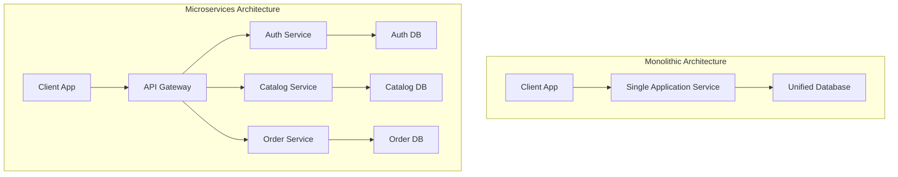

# Unit III: Microservices with Docker Compose

## 📋 1. Microservices Architecture

### Monolithic vs Microservices
- **Monolith:** An application built as a single autonomous unit. Scaling it means scaling the entire application. A bug in one module can crash the whole system.
- **Microservices:** An application broken down into small, independent services that communicate over lightweight APIs (REST or gRPC). This promotes:
  - **Scalability:** Scale individual components (e.g., scale only the payment service).
  - **Fault Isolation:** If the recommendation engine crashes, users can still check out.
  - **Agility:** Teams can deploy updates to individual services independently.
- **API Gateway:** A reverse proxy that accepts all API calls, aggregates services, and routes them to the correct microservice.



---

## 🛠️ 2. Docker Compose

Docker Compose is a tool for defining and running multi-container Docker applications. You use a YAML file to configure your application’s services, networks, and volumes.

### Key YAML Fields:
- `services`: Defines the containers to create.
- `build`: Path to context or git repo to build the image from a Dockerfile.
- `image`: Exact image to pull or use.
- `volumes`: Persistence mapping.
- `networks`: Isolated networks for communication.
- `environment`: Sets environment variables.
- `depends_on`: Service startup ordering dependency.

---

## 💻 3. Use Case Deployment: WordPress & MySQL Stack

Create the file `docker-compose.yml` to define this microservices stack:

```yaml
version: '3.8'

services:
  db:
    image: mysql:8.0
    container_name: amit_mysql_service
    restart: always
    environment:
      MYSQL_ROOT_PASSWORD: root_secret_pwd
      MYSQL_DATABASE: wordpress
      MYSQL_USER: wordpress_usr
      MYSQL_PASSWORD: wordpress_pwd
    volumes:
      - wordpress_db_data:/var/lib/mysql
    networks:
      - internal_network

  wordpress:
    image: wordpress:latest
    container_name: amit_wordpress_service
    restart: always
    ports:
      - "8080:80"
    environment:
      WORDPRESS_DB_HOST: db:3306
      WORDPRESS_DB_USER: wordpress_usr
      WORDPRESS_DB_PASSWORD: wordpress_pwd
      WORDPRESS_DB_NAME: wordpress
    depends_on:
      - db
    volumes:
      - wordpress_app_data:/var/www/html
    networks:
      - internal_network

volumes:
  wordpress_db_data:
    driver: local
  wordpress_app_data:
    driver: local

networks:
  internal_network:
    driver: bridge
```

### 🏃 Step 3.1: Run the Stack
To build and start the entire stack, use the following commands in the folder:

```bash
# Launch containers in detached mode
docker compose up -d

# Check status of composed services
docker compose ps

# View the runtime output logs
docker compose logs -f

# Shutdown and clean up the stack
docker compose down -v
```

### Docker Compose Demonstration (Amit Example)

