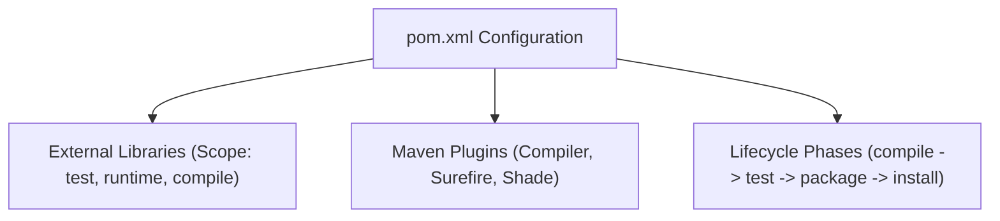
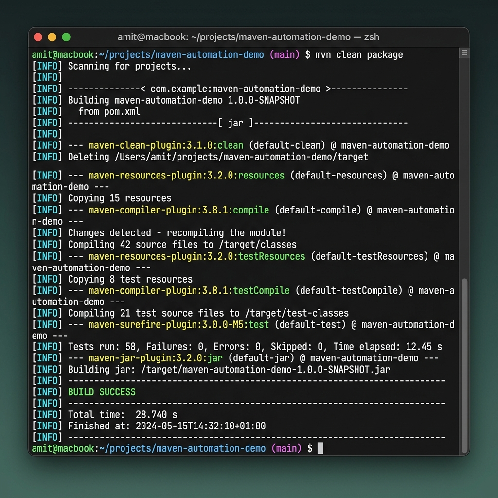
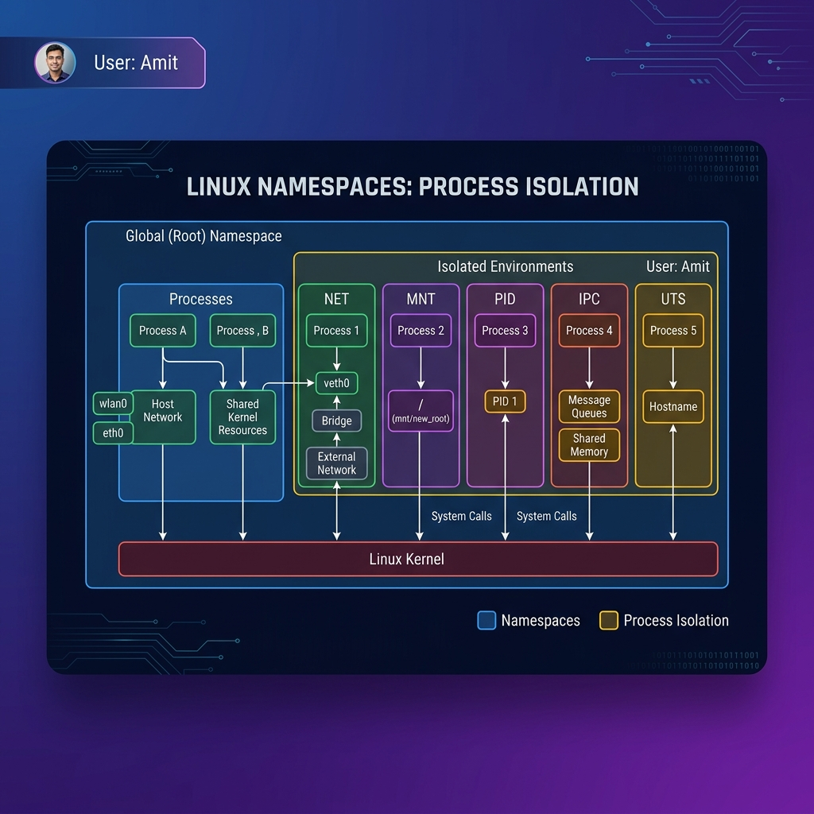
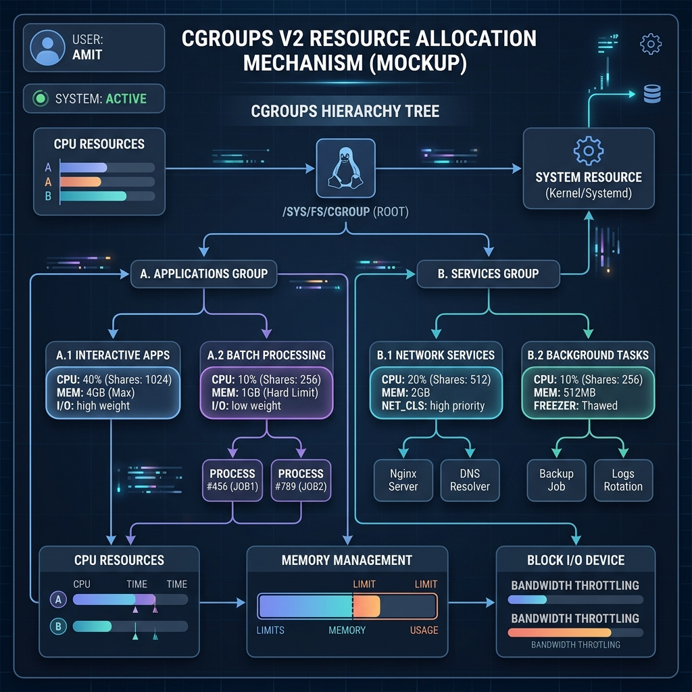

# Unit IV: Maven Build Automation

## 📋 1. Core Concepts & Build Tools

### Why Do Build Tools Exist?
Developing enterprise software requires compiling code, managing external dependencies, running tests, and packaging artifacts (e.g., `.jar`, `.war`). Manual execution of these steps is error-prone and unscalable.
- **Problems Solved by Automated Builds:** Dependency downloads, version conflict resolution, uniform build lifecycle, automated testing, and reproducible binaries.

---

## 🛠️ 2. The Project Object Model (POM) & Lifecycle

The `pom.xml` file is the fundamental unit of work in Maven. It contains information about the project and configuration details used by Maven to build the project.



### Standard Maven Directory Structure
Maven defines a strict layout out-of-the-box:
```text
my-app/
├── pom.xml
└── src/
    ├── main/
    │   ├── java/         # Application source code
    │   └── resources/    # Properties/configuration files
    └── test/
        ├── java/         # Test source code
        └── resources/    # Test-specific configuration files
```

### Maven Build Lifecycle Phases
Maven is based around the central concept of a build lifecycle. The main default phases are:
1. `validate`: Validates that the project is correct and all necessary information is available.
2. `compile`: Compiles the source code of the project.
3. `test`: Runs the unit tests using a suitable framework.
4. `package`: Takes the compiled code and packages it in its distributable format (e.g., JAR).
5. `verify`: Runs integration tests and checks the packaged artifact.
6. `install`: Installs the package into the local repository for use as a dependency.
7. `deploy`: Copies the final package to the remote repository.

---

## 💻 3. Dependency & Plugin Management

### Scopes & Conflicts
- **Dependency Scope:** Restricts the transitivity of a dependency and determines when it is included in the classpath (e.g., `compile`, `test`, `provided`, `runtime`, `system`).
- **Transitive Dependencies:** When your project depends on `A`, and `A` depends on `B`, Maven automatically includes `B`. 
- **Conflict Resolution:** If `A` depends on `C:v1.0` and `B` depends on `C:v2.0`, Maven resolves the conflict using the *nearest-definition* rule.

### Essential Maven Plugins
- `maven-compiler-plugin`: Compiles Java sources.
- `maven-surefire-plugin`: Executes Unit Tests.
- `maven-shade-plugin`: Builds an Uber-JAR (Fat-JAR) containing dependencies.

---

## 📝 4. Sample `pom.xml` Configuration

Create the following file inside the project workspace:

```xml
<?xml version="1.0" encoding="UTF-8"?>
<project xmlns="http://maven.apache.org/POM/4.0.0"
         xmlns:xsi="http://www.w3.org/2001/XMLSchema-instance"
         xsi:schemaLocation="http://maven.apache.org/POM/4.0.0 http://maven.apache.org/xsd/maven-4.0.0.xsd">
    <modelVersion>4.0.0</modelVersion>

    <groupId>com.amit.devops</groupId>
    <artifactId>maven-automation-demo</artifactId>
    <version>1.0.0</version>

    <properties>
        <maven.compiler.source>17</maven.compiler.source>
        <maven.compiler.target>17</maven.compiler.target>
        <project.build.sourceEncoding>UTF-8</project.build.sourceEncoding>
    </properties>

    <!-- Project dependencies -->
    <dependencies>
        <!-- Standard JUnit 5 for Unit Testing -->
        <dependency>
            <groupId>org.junit.jupiter</groupId>
            <artifactId>junit-jupiter-api</artifactId>
            <version>5.10.0</version>
            <scope>test</scope>
        </dependency>
    </dependencies>

    <build>
        <plugins>
            <!-- Compiler Plugin -->
            <plugin>
                <groupId>org.apache.maven.plugins</groupId>
                <artifactId>maven-compiler-plugin</artifactId>
                <version>3.11.0</version>
                <configuration>
                    <source>17</source>
                    <target>17</target>
                </configuration>
            </plugin>
            <!-- Test Plugin -->
            <plugin>
                <groupId>org.apache.maven.plugins</groupId>
                <artifactId>maven-surefire-plugin</artifactId>
                <version>3.1.2</version>
            </plugin>
        </plugins>
    </build>
</project>
```

---

## 🐳 5. Dockerizing Maven Applications

To optimize builds, we can write a multi-stage Dockerfile to build and package Java applications within containers:

```dockerfile
# Stage 1: Build the Maven application
FROM maven:3.9-eclipse-temurin-17 AS build
WORKDIR /app
COPY pom.xml .
RUN mvn dependency:go-offline
COPY src ./src
RUN mvn clean package -DskipTests

# Stage 2: Run the Java app with Temurin JRE
FROM eclipse-temurin:17-jre-alpine
WORKDIR /app
COPY --from=build /app/target/*.jar app.jar
EXPOSE 8080
ENTRYPOINT ["java", "-jar", "app.jar"]
```

### Build Commands:
```bash
# Execute maven clean package via terminal
mvn clean package

# Run tests directly
mvn test
```

### Maven Integration Demonstration (Amit Example)


## 📸 Complete Unit 4 Visual Gallery (8 Images Total)

````carousel

<!-- slide -->

<!-- slide -->

<!-- slide -->

<!-- slide -->

<!-- slide -->

<!-- slide -->

````


