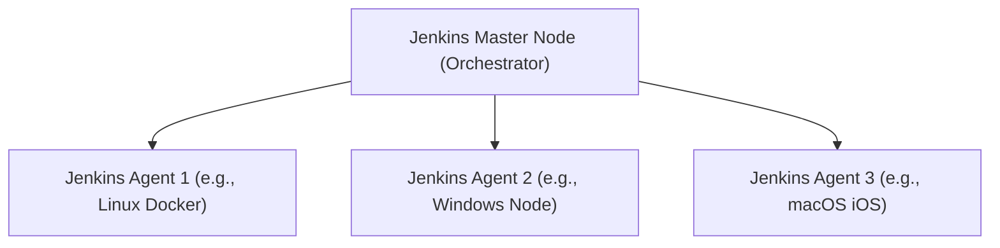
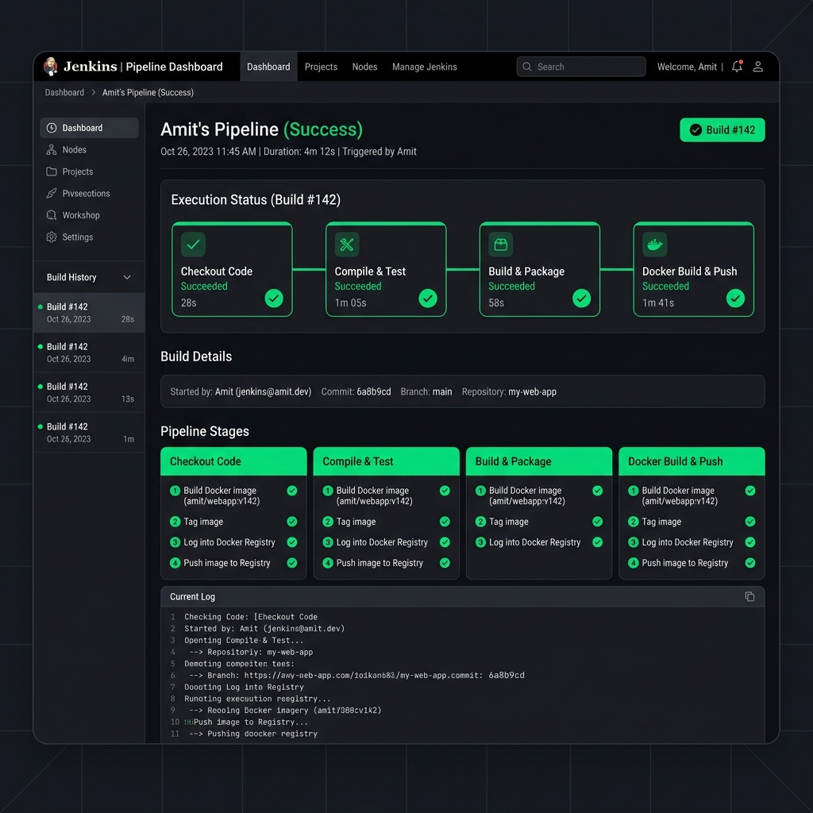
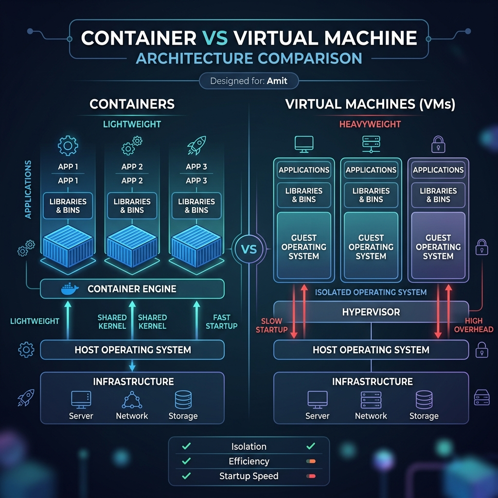
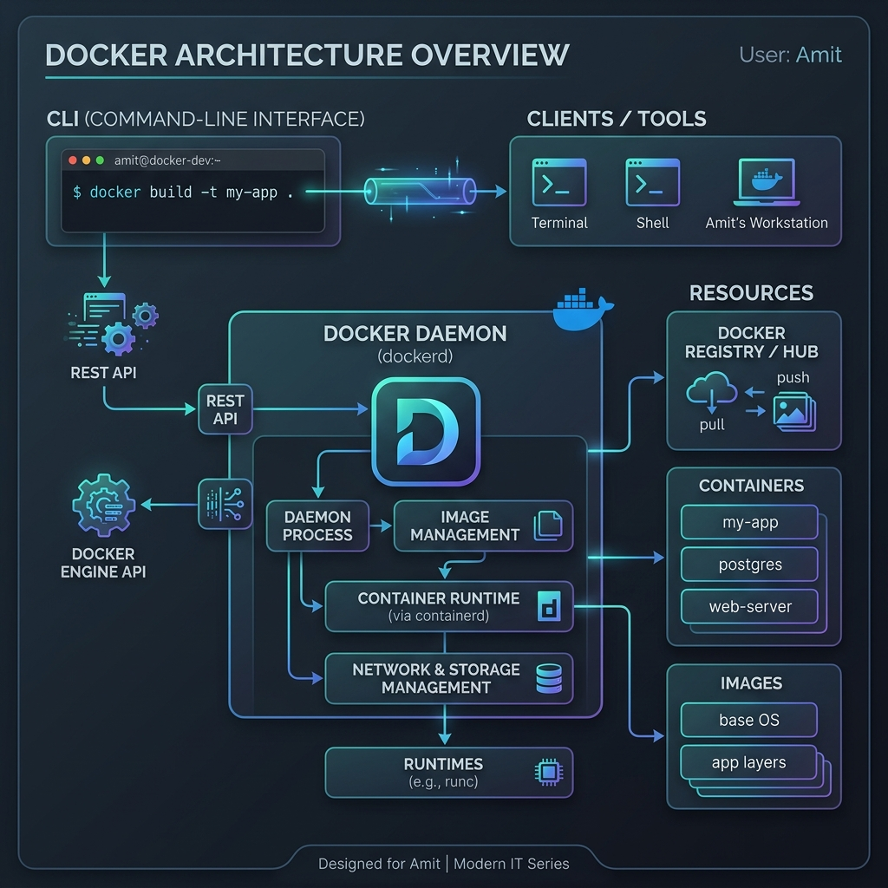
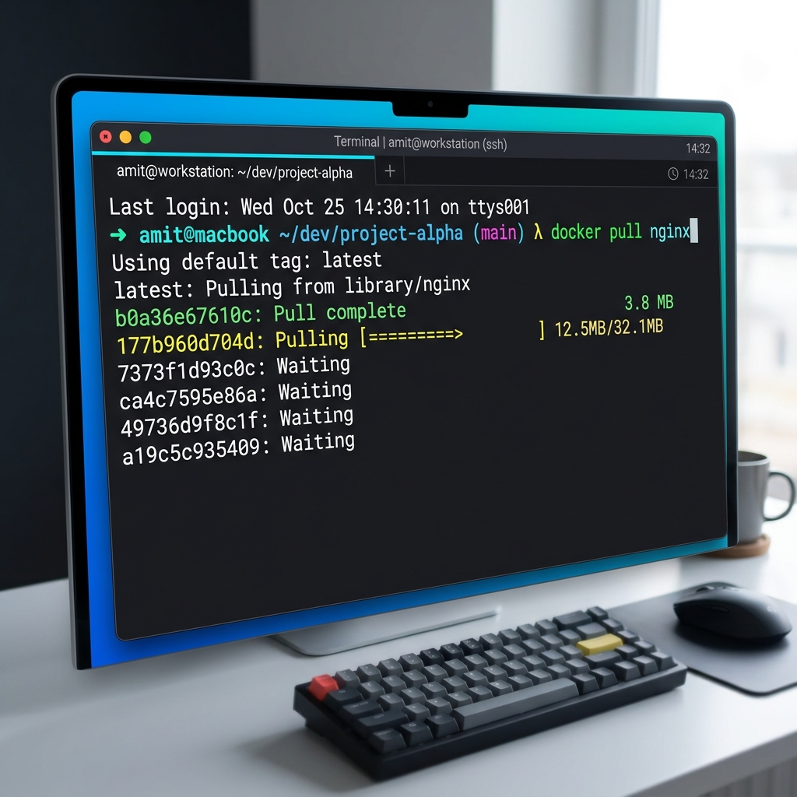
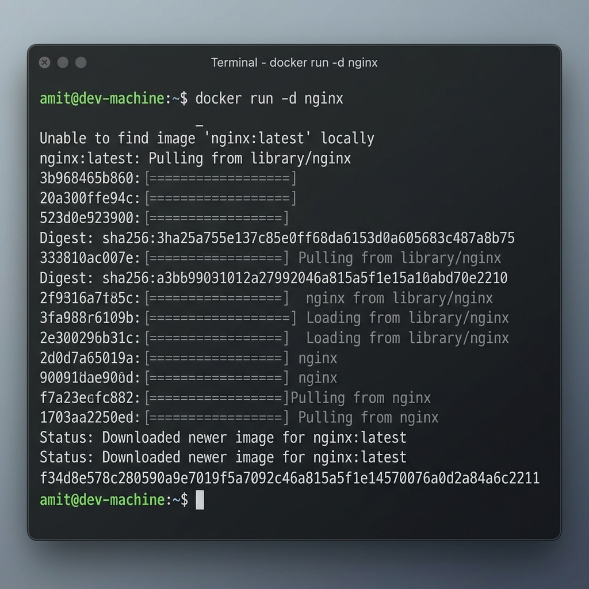
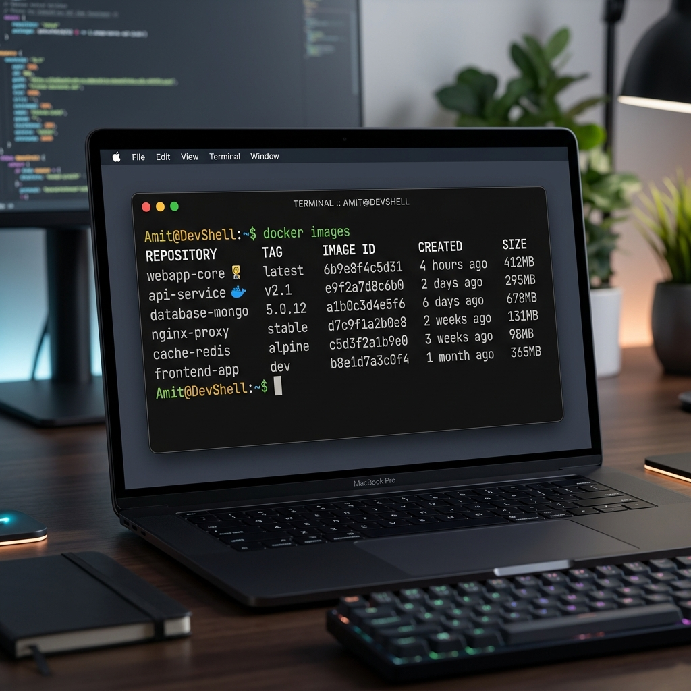

# Unit VI: CI/CD with Jenkins

## 📋 1. Jenkins Architecture & Foundations

Jenkins is an open-source automation server used to automate various parts of software development, including building, testing, and deploying.
- **Master/Agent Model:**
  - **Master (Controller):** Handles scheduling jobs, dispatching builds to agents, monitoring agents, and recording results.
  - **Agent (Worker):** Executes job steps sent by the master. This can be VMs, bare-metal servers, or ephemeral Docker containers.



---

## 🛠️ 2. Jenkins Pipelines: Scripted vs Declarative

- **Freestyle Job:** Older approach. Configured using the Jenkins Web UI. Difficult to maintain or version control.
- **Scripted Pipeline:** Written in Groovy. Imperative style. Offers maximum flexibility but harder to read.
- **Declarative Pipeline:** Simplifies writing pipeline code. More structured, with defined syntax blocks (`pipeline`, `agent`, `stages`, `steps`, `post`). Recommended best practice.

---

## 💻 3. Declarative `Jenkinsfile` Template

Create a file named `Jenkinsfile` at the root of your project:

```groovy
pipeline {
    agent any

    environment {
        DOCKER_HUB_CREDENTIALS = credentials('amit-docker-hub-secret')
        IMAGE_NAME = "amit/my-app"
        IMAGE_TAG = "latest"
    }

    options {
        timeout(time: 1, unit: 'HOURS')
        buildDiscarder(logRotator(numToKeepStr: '10'))
    }

    stages {
        stage('Checkout Code') {
            steps {
                git branch: 'main', url: 'https://github.com/Amit123103/githubdevops.git'
            }
        }

        stage('Compile & Test') {
            steps {
                // Ensure Maven is globally configured in Jenkins
                sh 'mvn clean test'
            }
        }

        stage('Build & Package') {
            steps {
                sh 'mvn package -DskipTests'
                archiveArtifacts artifacts: '**/target/*.jar', fingerprint: true
            }
        }

        stage('Docker Build & Push') {
            steps {
                sh """
                    echo \$DOCKER_HUB_CREDENTIALS_PSW | docker login -u \$DOCKER_HUB_CREDENTIALS_USR --password-stdin
                    docker build -t ${IMAGE_NAME}:${IMAGE_TAG} .
                    docker push ${IMAGE_NAME}:${IMAGE_TAG}
                """
            }
        }
    }

    post {
        always {
            cleanWs()
            echo "Pipeline finished execution."
        }
        success {
            echo "CI/CD Pipeline executed successfully for Amit!"
        }
        failure {
            echo "Pipeline failed. Check build logs for errors."
        }
    }
}
```

---

## 🐳 4. Advanced Jenkins and Docker Integration

Using Docker inside Jenkins pipelines provides dynamic execution environments.

### Using Docker Inside Jenkins Agents
You can force a stage or the whole pipeline to execute inside a specific Docker container.
```groovy
pipeline {
    agent {
        docker { image 'maven:3-openjdk-17-slim' }
    }
    stages {
        stage('Build') {
            steps {
                sh 'mvn clean package'
            }
        }
    }
}
```

### 🔁 Webhooks & Triggering
1. **Webhook:** GitHub sends a POST payload to Jenkins on every code commit. Triggers a new build automatically.
2. **Polling (`pollSCM`):** Jenkins checks the repository at configured intervals (e.g., `H/5 * * * *` every 5 minutes) to see if changes occurred.

---

### Jenkins Pipeline Demonstration (Amit Example)


## 📸 Complete Unit 6 Visual Gallery (8 Images Total)

````carousel

<!-- slide -->

<!-- slide -->

<!-- slide -->

<!-- slide -->

<!-- slide -->

<!-- slide -->

````


